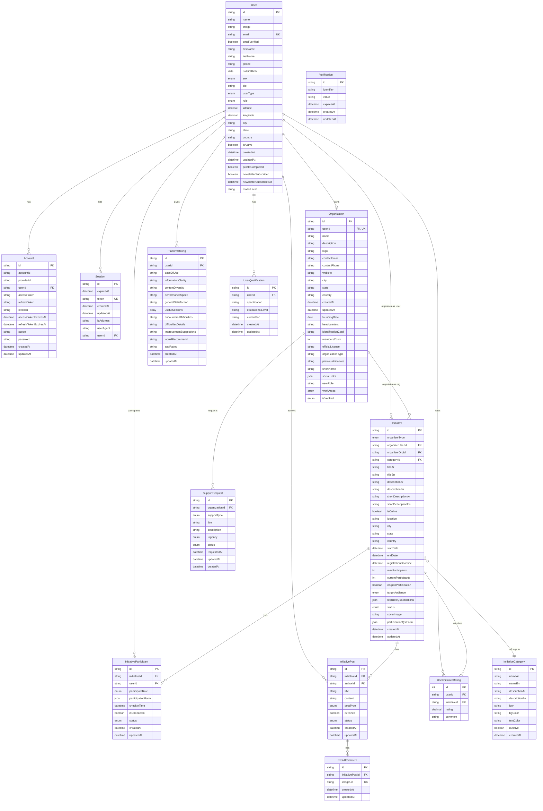

# Badir - Community Initiative Platform

**Badir** is a comprehensive platform designed to connect volunteers and participants with meaningful community initiatives. The platform enables organizations and individuals to create, manage, and participate in social impact projects across various categories.

**Purpose**: Badir aims to build stronger communities by facilitating collaboration between initiative organizers and community members, making it easier to discover, join, and contribute to positive social change initiatives.

## Features

### Core Functionality

- **Initiative Discovery**: Browse and search community initiatives with advanced filtering
- **User Authentication**: Secure login/signup for individuals and organizations
- **Profile Management**: Complete user profiles with location and preferences
- **Initiative Participation**: Join initiatives as helper or participant
- **Organization Management**: Create and manage organizational accounts
- **Rich Content Creation**: TipTap editor with image upload and formatting
- **Multi-language Support**: Arabic (RTL) and English interface
- **Responsive Design**: Optimized for desktop, tablet, and mobile

### Advanced Features

- **Dynamic Participation Forms**: Custom questions per initiative
- **Role-based Access Control**: Admin, Manager, Member roles
- **File/Image Management**: Supabase storage with safe deletion
- **Search & Filters**: Full-text search with category, location, and status filters
- **Pagination**: Efficient cursor-based data loading
- **Rating System**: Platform and initiative ratings
- **Admin Dashboard**: Initiative and organization approval workflow

## Tech Stack

### Frontend

- **Next.js 15** - React framework with App Router
- **React 19** - UI library
- **TypeScript** - Type-safe development
- **Tailwind CSS 4** - Utility-first CSS framework with RTL support
- **Shadcn/UI & Radix UI** - Accessible, composable components

### Backend & Database

- **Prisma ORM** - PostgreSQL schema and migrations
- **Better Auth** - Authentication with JWT sessions
- **Supabase** - File storage with RLS policies

### Form & Content Management

- **React Hook Form** - Form state management
- **Zod** - Schema validation
- **TipTap Editor** - Rich text editing
- **DOMPurify** - HTML sanitization
- **sanitize-html** - Content sanitization (both client-side and server-side)
- **html-react-parser** - Safe HTML rendering in React (both client-side and server-side)
- **cheerio** - Server-side HTML parsing and manipulation

## Architecture Overview

### Folder Structure

```
badir-bunian/
├── actions/ # Server actions for API logic
├── app/ # Next.js App Router pages
│ ├── (auth)/ # Authentication pages
│ ├── admin/ # Admin dashboard
│ ├── api/ # API routes
│ └── initiatives/ # Initiative pages
├── components/ # Reusable UI components
│ ├── layout/ # Footer, Navbar
│ ├── pages/ # Page-specific components
│ └── ui/ # UI primitives (Shadcn)
├── data/ # Static data, routes, statistics
├── hooks/ # Custom React hooks
├── lib/ # Utilities, auth, Supabase client
├── prisma/ # Database schema and migrations
├── schemas/ # Zod validation schemas
├── services/ # Business logic layer
└── types/ # TypeScript definitions
```

### Database Schema



### Data Flow

Client Request → Server Function / Next.js API Route → Service Layer → Prisma ORM → PostgreSQL

## Setup Instructions

### Prerequisites

- Node.js 18+ and npm
- PostgreSQL database
- Supabase account (for file storage)

### Installation

1. **Clone the repository**

```bash
   git clone https://github.com/algerian-tech-makers/Badir
   cd Badir
```

### Install dependencies

```bash
   npm install
```

### Set up environment variables

```bash
   cp .env.example .env.local
```

```bash
   cp .env.example .env.local
```

### Configure the following in .env.local:

- Database URL (PostgreSQL)
- Better Auth secrets
- Supabase credentials
- Resend API key and email configuration

### Set up database

```bash
   npx prisma migrate dev
   npx prisma db seed
```

### Start development server

```bash
   npm run dev
```

### Open your browser

```bash
   http://localhost:3000
```

## Key Components

### Reusable UI Components

- `FormInput`: Typed input with validation and error mapping
- `AppButton`: Consistent button styles with loading states
- `FilterSelect`: Dynamic filtering for initiatives
- `PostEditor`: TipTap-based rich text editor
- `InitiativeCard`: Initiative display with status badges
- `SearchInput`: Full-text search functionality
- `PaginationControls`: Cursor-based pagination UI
- `Ratings`: Star rating display and input

### Form Components

- `FormFieldCreator`: Dynamic form builder
- `SignupForm`: Multi-step registration flow
- `InitiativeForm`: Initiative creation and editing
- `CompleteProfileForm`: Profile completion workflow

## API Routes

```bash
/api/auth/[...all] # Better Auth handlers
/api/initiatives/ # Initiative CRUD operations
/api/organizations/ # Organization management
/api/participations/ # Participation requests
```

## Server Actions

```bash
actions
│  ├─ admin.ts  # Admin-related actions
│  ├─ helpers.ts    # Helper functions
│  ├─ initiatives.ts    # Initiative-related actions
│  ├─ login.ts  # Login action
│  ├─ logout.ts # Logout action
│  ├─ organization-profile.ts   # Organization profile actions
│  ├─ participation.ts  # Participation-related actions
│  ├─ posts.ts  # Initiative posts actions
│  ├─ signup.ts  # Signup action
│  ├─ submitRating.ts  # Submit rating action
│  └─ user-profile.ts  # User profile actions
```

---

## Admin Setup

To promote a user to admin role, run: `npm run admin:promote` and follow the prompts to enter the user's email address.

---

## Email Systems

Badir uses two separate email services, each optimized for its specific purpose:

### Transactional Emails (Resend)

**Purpose**: Time-sensitive, user-triggered emails requiring high deliverability

**Use Cases**:

- Password reset links
- Contact form submissions
- Feedback notifications
- Account-related notifications

**Configuration**:

```bash
RESEND_API_KEY=re_...
RESEND_FROM_EMAIL=noreply@yourdomain.com
CONTACT_EMAIL=contact@yourdomain.com
```

**Implementation**: Uses [Resend](https://resend.com) with `react-email` templates for type-safe, responsive emails.

### Newsletter Emails (MailerLite)

**Purpose**: Marketing, newsletters, and bulk communications

**Use Cases**:

- Newsletter subscriptions
- Campaign delivery
- Audience segmentation
- Email analytics

**Configuration**:

```bash
MAILERLITE_API_KEY=eyJ...
MAILERLITE_WEBHOOK_SECRET=...
```

**Implementation**: Uses [MailerLite](https://mailerlite.com) API for subscription management with production-ready rate limiting via Upstash Redis.

### Webhook Queue System

To keep user newsletter status synchronized with MailerLite (unsubscribes, bounces, etc.), Badir implements a database-backed webhook queue:

**Flow**:

1. **Fast Webhook Endpoint** (`/api/webhooks/mailerlite`):
   - Validates HMAC-SHA256 signature
   - Enqueues events to `webhook_events` table
   - Returns 200 OK in <3 seconds

2. **Background Cron Worker** (`/api/cron/process-webhooks`):
   - Runs every minute via Vercel Cron
   - Processes 10 oldest events per batch
   - Updates user newsletter status
   - Deletes successfully processed events
   - Failed events remain for automatic retry

**Required Environment Variables**:

```bash
CRON_SECRET=...  # Generated via: openssl rand -base64 32
UPSTASH_REDIS_REST_URL=https://...  # For rate limiting
UPSTASH_REDIS_REST_TOKEN=...
```

**Deployment Notes**:

- Run `npm run db:migrate` to create `webhook_events` table
- Configure webhook in MailerLite dashboard after deployment
- Vercel Cron activates automatically in production
- See `WEBHOOK_QUEUE_QUICK_START.md` for complete setup guide

**Why Two Services?**

- **Compliance**: Transactional emails must not contain marketing content
- **Deliverability**: Separate IP reputation prevents marketing campaigns from affecting critical notifications
- **Cost**: MailerLite provides better economics for bulk newsletters
- **Features**: MailerLite offers advanced analytics, A/B testing, and audience management

---

# License

<a href="https://github.com/algerian-tech-makers/Badir">Badir</a> © 2025 is licensed under <a href="https://creativecommons.org/licenses/by-nc-sa/4.0/">Creative Commons Attribution-NonCommercial-ShareAlike 4.0 International</a><br/>
